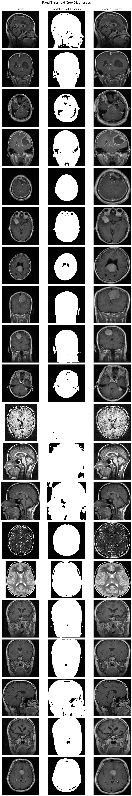
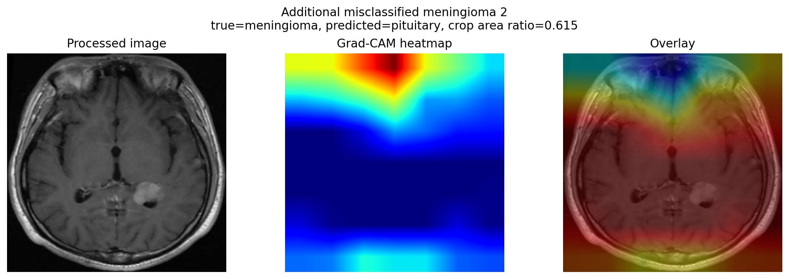
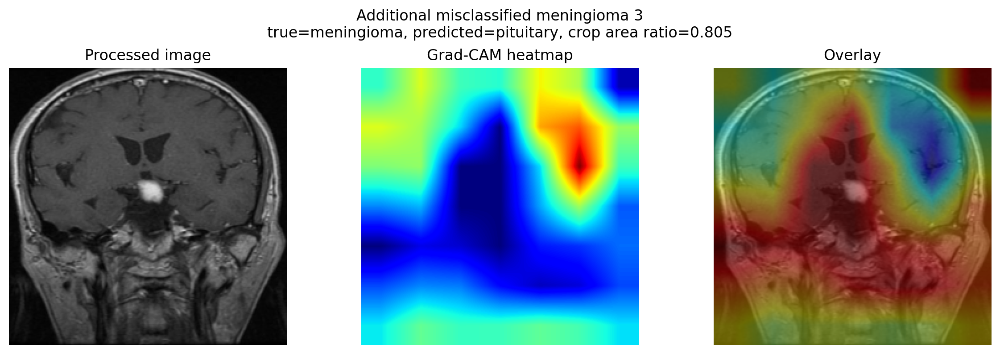
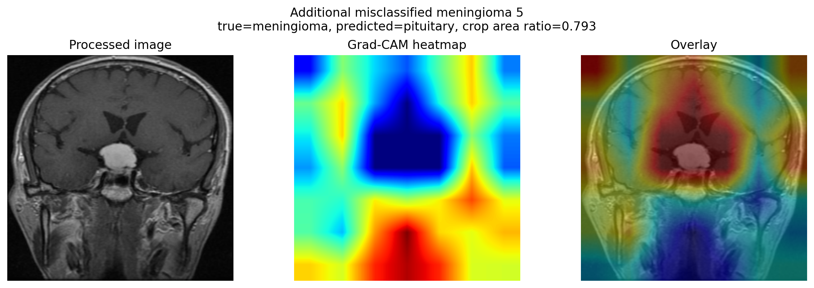
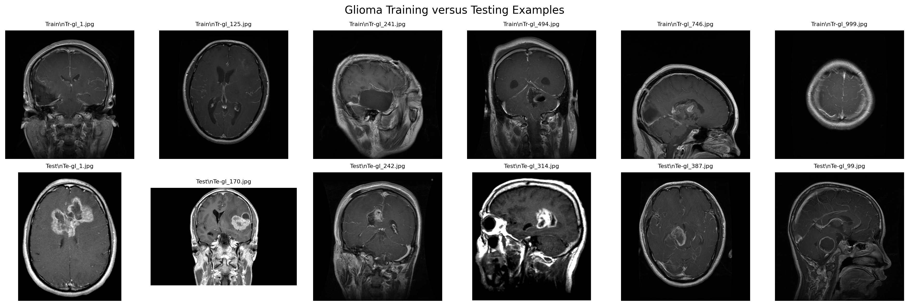
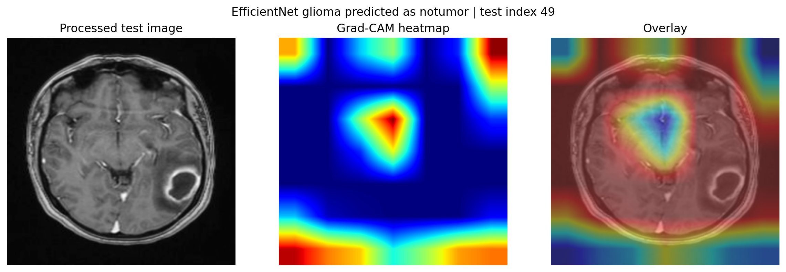
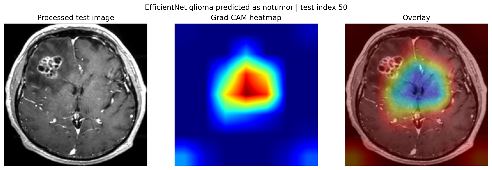
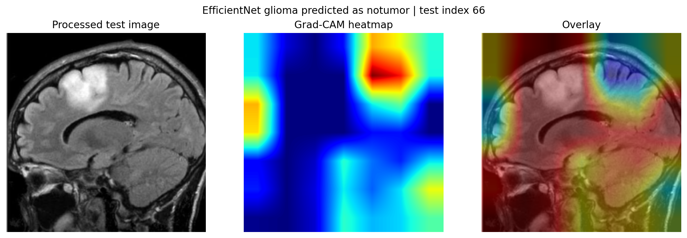

# Brain Tumor MRI Classification

Classify brain MRI scans as **glioma**, **meningioma**, **pituitary**, or **notumor**, with model explainability through Grad-CAM attention maps.

## Problem

This project investigates four-class brain tumor classification from MRI scans. The first goal is to classify each scan as glioma, meningioma, pituitary tumor, or no tumor. The second goal is to approximately localize the visual evidence used by the model with Grad-CAM. There are no true pixel-level tumor segmentation masks in this dataset, so localization is an attention-based analysis rather than a segmentation result.

## Dataset

The project uses the Kaggle Brain Tumor MRI dataset with four balanced classes:

| Split    | Glioma | Meningioma | Notumor | Pituitary |
| -------- | -----: | ---------: | ------: | --------: |
| Training |  1,400 |      1,400 |   1,400 |     1,400 |
| Testing  |    400 |        400 |     400 |       400 |

The `Testing` folder was held out and left untouched until the final evaluation. The full workflow is documented in [MRI_SCAN.ipynb](MRI_SCAN.ipynb).

The dataset is available from Kaggle: [Brain Tumor MRI Dataset](https://www.kaggle.com/datasets/masoudnickparvar/brain-tumor-mri-dataset). Check the dataset page for its current terms before redistributing the data; raw images are not included in this repository.

## Setup and Usage

Install the Python dependencies with:

```bash
pip install -r requirements.txt
```

Place the dataset in a folder containing `Training/` and `Testing/`, then point the notebook at it before running:

```bash
export MRI_DATA_DIR=/path/to/brain-tumor-mri
```

On Windows PowerShell, use `$env:MRI_DATA_DIR = "C:\\path\\to\\brain-tumor-mri"`. When the variable is unset, the notebook uses the first existing `./Data`, `./data`, or `./archive` folder. If neither exists, it reports the required folder structure and configuration setting.

The notebook stages are: EDA, preprocessing, baseline CNN, EfficientNet transfer learning, Grad-CAM analysis, and held-out test evaluation. Reusable loading, dataset, model, and Grad-CAM code lives in [utils.py](utils.py).

## Repo Structure

```text
MRI_SCAN.ipynb
utils.py
requirements.txt
.gitignore
LICENSE
assets/
```

The `assets/` folder contains only the eight images referenced by this README. Full notebook-generated output folders remain ignored.

## Environment

Developed with Python 3.10 and TensorFlow 2.16.1. Small differences may occur across TensorFlow versions, hardware, and backends.

## Exploratory Data Analysis

- **Data integrity:** 0 corrupt files across all 7,200 images.
- **Dimension variance:** 40 unique image sizes in the inspected sample, ranging from `173 x 201` to `1335 x 1302`.
- **Grayscale confirmation:** all sampled RGB channels were identical, confirming grayscale images stored as three-channel files.
- **Background finding:** near-black pixel fraction differed by class. `notumor` had the lowest and most variable black-pixel fraction, while glioma and meningioma generally had the highest fractions. This was the hypothesis-setting observation: background and framing might become a shortcut or shift-related signal for the classifier.

## Preprocessing

Each image was processed with:

1. Gaussian blur
2. A fixed intensity threshold selected from the EDA diagnostics
3. Morphological opening and closing
4. External contour detection with a minimum-area filter
5. Cropping to the largest valid contour
6. Resizing to `224 x 224`

Two edge cases were explicitly debugged:

- **Near-full-image bounding boxes:** 516 of 7,200 images produced a valid bounding box covering nearly the full image. The per-class rates were `notumor 30.83%`, `pituitary 26.94%`, `meningioma 7.61%`, and `glioma 3.72%`. These were valid minimal-crop cases, not failed detections, and were tracked separately from true fallbacks.
- **Noisy backgrounds:** blur plus minimum contour-area filtering removed small disconnected components that previously caused unstable crops. The notebook includes before/after threshold and crop diagnostics in the preprocessing section.



## Models and Test Results

The baseline model is a four-block grayscale CNN with batch normalization, pooling, global average pooling, and a softmax classifier. The transfer-learning model uses an ImageNet-pretrained EfficientNetB0: first the backbone is frozen, then the final 30 backbone layers are fine-tuned with a lower learning rate.

| Model                       | Test Accuracy | Test Macro F1 |
| --------------------------- | ------------: | ------------: |
| Baseline CNN                |        90.50% |        0.9028 |
| EfficientNetB0 (fine-tuned) |        91.44% |        0.9123 |

The results are near-parity, with EfficientNet modestly ahead on this run. That is plausible because ImageNet features were learned from natural RGB images, while these inputs are grayscale medical scans with different texture and contrast statistics. The exact values are generated by the held-out evaluation cell in [MRI_SCAN.ipynb](MRI_SCAN.ipynb); the generated comparison CSV is ignored and is not included in clones.

## Reproducibility

Early experiments showed run-to-run variance from unseeded initialization and augmentation. This was fixed with `tf.keras.utils.set_random_seed(42)`, together with fixed dataset split and shuffle seeds.

The reported metrics and figures in the notebook describe the most recent completed run. The baseline validation accuracy was **94.37%** and the fine-tuned EfficientNet validation accuracy was **94.64%**. Exact values are not guaranteed to reproduce without the same TensorFlow version, hardware, backend, and dataset files. Trained checkpoints, arrays, histories, and diagnostic figures are generated outputs and are excluded from version control by [.gitignore](.gitignore).

## Error Analysis

### Meningioma Grad-CAM

For validation-time meningioma cases, the average fraction of Grad-CAM energy inside the thresholded brain interior was **80.1%** for correctly classified cases and **69.9%** for misclassified cases. The corresponding average border energy was **16.9%** versus **25.4%**. This supports a relationship between meningioma errors and attention shifted toward the image border, while remaining an attention proxy rather than anatomical localization.

The underlying values are generated by the Grad-CAM analysis in [MRI_SCAN.ipynb](MRI_SCAN.ipynb). The per-case and summary CSV outputs are ignored and are not included in clones.







### Glioma Test-Time Generalization Gap

The baseline history ended at **95.36% training accuracy** and **93.12% validation accuracy**, with a best validation accuracy of **94.38%**. Baseline glioma recall on the untouched test set was **76.00%**. This points to a combination of a modest train/validation overfit and a meaningful train/test generalization gap.

The test confusion patterns were:

- Baseline CNN: glioma -> meningioma `39`, glioma -> `notumor` `48`, glioma -> pituitary `9`.
- Fine-tuned EfficientNetB0: glioma -> meningioma `65`, glioma -> `notumor` `26`, glioma -> pituitary `5`.

The training/testing visual comparison suggests differences in framing, slice orientation, contrast, and lesion presentation. This shifted the weak-class finding from a validation-time attention pattern to a test-time generalization question: some glioma lesions may be small or subtle, while some cases may also differ in presentation from the training distribution.



Grad-CAM panels for EfficientNet glioma cases predicted as `notumor` are saved here:







## Limitations

- Grad-CAM is a coarse attention proxy, not true pixel-level segmentation.
- The dataset has no true tumor masks, so localization is approximate.
- The train/test visual comparison uses a small descriptive sample and is not a formal statistical distribution-shift test.
- The dataset was assembled from multiple sources, so inconsistencies between the `Training` and `Testing` folders are possible.

This project is for research and educational purposes only. It is not a medical device and must not be used for diagnosis, treatment, or clinical decision-making.

## Next Steps

Extend the Grad-CAM analysis across more glioma errors, evaluate true tumor segmentation with a dataset such as BraTS, and perform seeded repeated runs to quantify remaining reproducibility variance.

## License

The source code in this repository is licensed under the MIT License. The Kaggle dataset has separate terms; consult its dataset page before downloading or redistributing the images.
